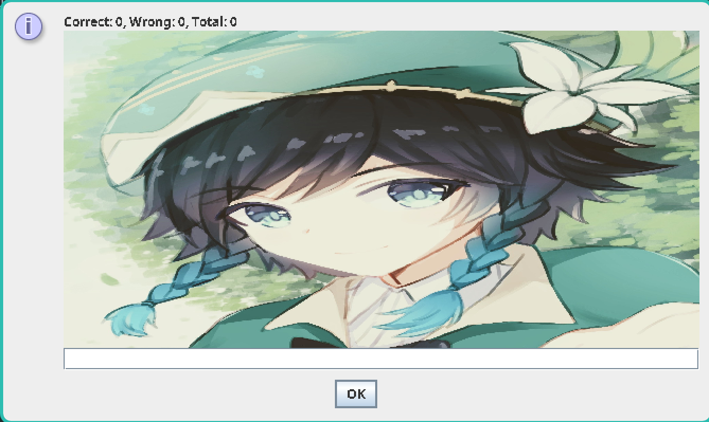

<!-- Improved compatibility of back to top link: See: https://github.com/othneildrew/Best-README-Template/pull/73 -->
<a id="readme-top"></a>

<!-- PROJECT LOGO -->
<br />
<div align="center">
<h3 align="center">Worttrainer reloaded</h3>

  <p align="center">
    This project is the task "[GK] 9a.1: Worttrainer Reloaded" from school (subject: software development).
    <br />
    <a href="https://github.com/TGM-HIT/sew9-2425-worttrainer-k1W1M4ng0"><strong>Explore the docs »</strong></a>
    <br />
    <br />
    <a href="https://github.com/TGM-HIT/sew9-2425-worttrainer-k1W1M4ng0/issues/new">Report Bug / Request Feature</a>
    ·
    <a href="https://github.com/TGM-HIT/sew9-2425-worttrainer-k1W1M4ng0/pulls">Contribute</a>
  </p>
</div>

<!-- ABOUT THE PROJECT -->
## About The Project

 

The goal of this task is to create a game for primary school students to practice spelling.

Every round, a picture is shown while the child should type in the corresponding word.
The input is then checked for spelling mistakes and a message will be printed.

<p align="right">(<a href="#readme-top">back to top</a>)</p>


<!-- GETTING STARTED -->
## Getting Started

### Prerequisites

To run this game, you need java 21:


* npm
  ```sh
  npm install npm@latest -g
  ```

### Installation

1. Clone the repo
   ```sh
   git clone https://github.com/github_username/repo_name.git
   ```
2. Run with gradle
   ```sh
   ./gradlew run
   ```

<p align="right">(<a href="#readme-top">back to top</a>)</p>


<!-- USAGE EXAMPLES -->
## Usage

 

A dialog is shown with the statistics, the next image and an input field. 
Enter a word in the input field to guess. Leading and trailing whitespace is trimmed.
Leave the field empty or close the dialog to exit the game.

<p align="right">(<a href="#readme-top">back to top</a>)</p>
